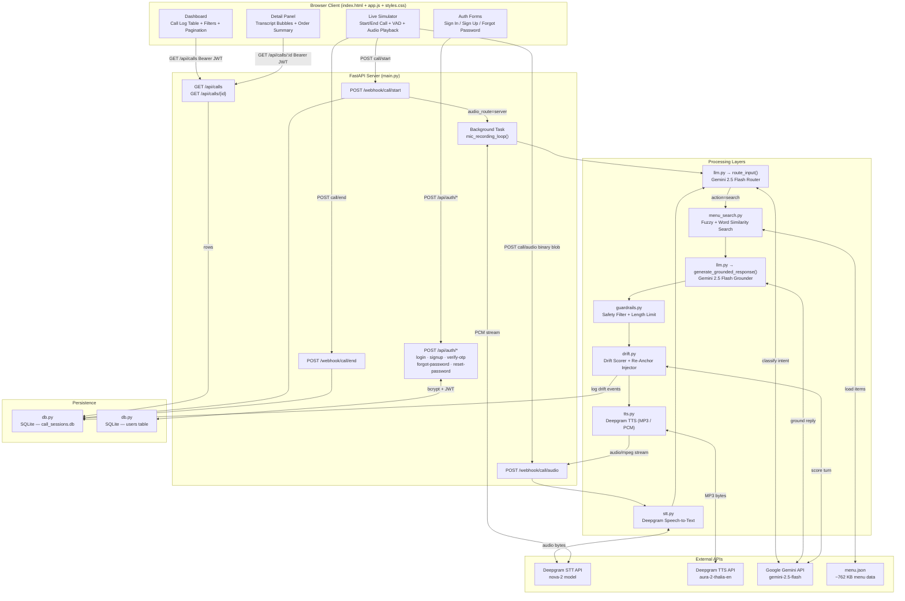

# Hot Bagels AI — Voice Agent Orchestrator

A production-grade **restaurant voice ordering system** powered by Gemini, Deepgram, and FastAPI. Customers call in and speak their order naturally. The AI agent transcribes their speech, understands the intent, searches the menu, validates the reply, detects any model drift, and speaks back a grounded, accurate response — all in real time.

A web-based **Control Center Dashboard** lets managers log in, review recorded call sessions with full transcripts and order summaries, monitor AI drift incidents, and initiate live test calls directly from the browser.

---

##  Architecture Diagram



---

## Project Structure

```
Dafinitic-AI/
├── menu.json                        ← Full restaurant menu (~762 KB)
└── app/
    ├── main.py                      ← FastAPI server & all HTTP endpoints
    ├── stt.py                       ← Deepgram Speech-to-Text layer
    ├── tts.py                       ← Deepgram Text-to-Speech layer
    ├── llm.py                       ← Gemini LLM router + grounder
    ├── menu_search.py               ← Fuzzy menu item search engine
    ├── guardrails.py                ← Safety & content filter layer
    ├── drift.py                     ← Model drift detection & correction
    ├── auth.py                      ← JWT + OTP + bcrypt authentication
    ├── db.py                        ← SQLite persistence layer
    ├── call_sessions.db             ← SQLite database file
    ├── requirements.txt             ← Python dependencies
    ├── test_api.py                  ← End-to-end API integration tests
    └── static/
        ├── index.html               ← Single-page web application
        ├── styles.css               ← Glassmorphic dark-mode CSS
        └── app.js                   ← Frontend logic & API client
```

---

## Module Reference

### `main.py` — FastAPI Orchestrator (674 lines)

The heart of the system. Imports and coordinates all other modules. Exposes all HTTP endpoints and manages in-memory active session state.

**Key Responsibilities:**
- Manages `_active_sessions` dict (in-memory context per call: transcript history, order items, turn index, audio route)
- Manages `_active_recording_tasks` dict (background mic loop tasks per session)
- On server startup, loads the full menu into `MENU_ITEMS`
- On shutdown, gracefully ends all active calls and persists data

**Endpoints:**

| Method | Path | Auth | Description |
|--------|------|------|-------------|
| `POST` | `/webhook/call/start` | None | Creates session, optionally spawns server mic loop |
| `POST` | `/webhook/call/audio` | None | STT→LLM→Search→Guard→Drift→TTS pipeline |
| `POST` | `/webhook/call/end` | None | Persists transcript + order to SQLite |
| `GET`  | `/api/calls` | JWT Bearer | Paginated list of all recorded sessions |
| `GET`  | `/api/calls/{id}` | JWT Bearer | Full detail: transcript + order + drift |
| `POST` | `/api/auth/signup` | None | Register user, send OTP |
| `POST` | `/api/auth/verify-otp` | None | Activate account via OTP |
| `POST` | `/api/auth/login` | None | Returns JWT access token |
| `POST` | `/api/auth/forgot-password` | None | Send password reset OTP |
| `POST` | `/api/auth/reset-password` | None | Verify OTP, update password |
| `GET`  | `/` | None | Serves `index.html` SPA |

---

### `stt.py` — Speech-to-Text (37 lines)

Sends raw audio bytes to **Deepgram's REST API** (`nova-2` model) and returns the text transcript.

- Uses `httpx` async client for non-blocking HTTP
- Auto-detects audio format (`application/octet-stream`)
- Enables `smart_format=true` for punctuation and casing
- Returns empty string if transcription is blank (silence)

**Data Flow:**  
`audio_bytes` → `Deepgram /v1/listen` → `transcript string`

---

### `tts.py` — Text-to-Speech (118 lines)

Synthesises agent replies into audio using **Deepgram's TTS REST API** (`aura-2-thalia-en` voice).

| Function | Output | Use Case |
|----------|--------|----------|
| `synthesize_speech(text)` | MP3 bytes | Browser audio playback via `/webhook/call/audio` response |
| `synthesize_speech_pcm(text)` | 16-bit PCM @16kHz | Local server speaker playback via `sounddevice` |
| `play_pcm_locally(pcm_bytes)` | Plays audio | Used in server mic loop (`audio_route=server`) |
| `speak_locally(text)` | Plays via PowerShell | Windows fallback if Deepgram unavailable |
| `generate_silent_wav(duration)` | Silent WAV bytes | Fallback when audio pipeline fails |

---

### `llm.py` — Gemini LLM Layer (106 lines)

Uses **Google Gemini 2.5 Flash** for two distinct tasks:

#### `route_input(query, chat_history)` → Intent Router
Classifies the user's utterance:
- `"respond"` → small talk / greetings / checkout → returns a canned conversational reply directly
- `"search"` → menu-related query → extracts a clean search phrase for `menu_search.py`

Returns structured JSON: `{ action, reply, search_query }`

#### `generate_grounded_response(query, chat_history, search_results)` → Menu Grounder
Generates a natural voice response **strictly grounded** on search results passed to it. If results are empty, it refuses to hallucinate and politely redirects.

---

### `menu_search.py` — Menu Search Engine (94 lines)

A strict, multi-stage fuzzy search engine over `menu.json` items.

**4-Stage Matching Pipeline:**

1. **Exact Substring** — If the item name is fully contained in the query → score `1.0`
2. **Word-Level Similarity Gate** — At least one query keyword must match an item word at `≥ 0.75` ratio (prevents false positives like "cheeseburger" matching "donut")
3. **Sliding Window Fuzzy Match** — `difflib.SequenceMatcher` over word-window sub-phrases → `best_fuzzy` score
4. **Description Overlap** — Bonus score if query words appear in item description

**Combined score:** `max(best_fuzzy, best_fuzzy * 0.8 + desc_score * 0.2)`  
Threshold: `≥ 0.65` to be included. Returns top 3 matches.

---

### `guardrails.py` — Safety Filter (80 lines)

Post-processes every LLM response before it reaches TTS. Acts as a final sanity check.

**Guards Applied (in order):**

1. **Length Limit** — Truncates responses exceeding 60 words; appends a polite continuation
2. **Markdown Sanitiser** — Strips `**bold**`, `` `code` ``, bullet points, code blocks — ensures clean spoken audio
3. **Off-Topic Blocker** — Regex patterns catch weather, politics, maths, history queries and return a refusal message
4. **Price Hallucination Check** — Extracts all `$X.XX` values; any price not found in `menu.json` triggers a refusal
5. **Item Hallucination Check** — Explicit deny-list for non-menu foods (pizza, burger, sushi, etc.) cross-checked against confirmation verbs

---

### `drift.py` — Model Drift Detection (128 lines)

Monitors each conversation turn to detect if the AI agent is deviating from its role.

**How it works:**

1. After each turn, calls Gemini with an **auditor prompt** asking it to score the turn `0.0–1.0`
2. Score is appended to `_session_scores[session_id]`
3. If **2+ consecutive turns score below 0.6**, `drift_detected = True`
4. A **corrective system message** is injected into the next turn's chat history to re-anchor the agent
5. Drift events are logged with `{ turn_index, score, corrected }` and persisted to SQLite on call end

**Score Rubric:**

| Score | Meaning |
|-------|---------|
| `1.0` | Perfect — focused on ordering |
| `0.8` | Minor deviation — slightly off but on topic |
| `0.5` | Significant drift — off-topic or made-up items |
| `0.0` | Complete failure — hallucination or argument |

---

### `auth.py` — Authentication Layer (62 lines)

Handles all security primitives:

- **`hash_password` / `verify_password`** — bcrypt hashing with auto-generated salts
- **`generate_jwt` / `verify_jwt`** — HS256 JWT tokens, 60-minute expiry, signed with `JWT_SECRET`
- **`generate_otp`** — 6-digit random OTP with a 5-minute expiry window
- **`is_otp_valid`** — Checks OTP equality AND expiry timestamp

---

### `db.py` — SQLite Persistence Layer (198 lines)

Manages two tables in `call_sessions.db`:

**`call_sessions` table:**

| Column | Type | Description |
|--------|------|-------------|
| `id` | TEXT PK | UUID session identifier |
| `started_at` | TEXT | UTC ISO timestamp of call start |
| `ended_at` | TEXT | UTC ISO timestamp of call end |
| `caller_id` | TEXT | Phone number or identifier |
| `transcript` | TEXT | JSON array of `{speaker, text, timestamp}` turns |
| `order_summary` | TEXT | JSON `{items: [...], total: float}` |
| `drift_detected` | INTEGER | `0` or `1` |
| `drift_log` | TEXT | JSON array of drift events |

**`users` table:**

| Column | Type | Description |
|--------|------|-------------|
| `email` | TEXT PK | User email (lowercase) |
| `password_hash` | TEXT | bcrypt hash |
| `display_name` | TEXT | Display name |
| `is_active` | INTEGER | `0` = pending OTP, `1` = active |
| `otp` | TEXT | Current OTP code (nullable) |
| `otp_expires` | TEXT | OTP expiry ISO timestamp |

---

### `static/index.html` — Single Page Application

A glassmorphic dark-mode SPA with three logical screens:

1. **Auth Screen** — Sign In / Sign Up (with OTP step) / Forgot Password (with OTP + reset step) — all dynamic, no page reload
2. **Dashboard** — Stats row, filterable/searchable call log table, pagination
3. **Right Column** — Live Simulator panel + Call Detail panel (transcript tabs + order table)

---

### `static/styles.css` — Design System

- Dark glassmorphic theme with CSS variables (`--glass-bg`, `--border-color`, `--accent-primary`)
- Google Fonts: `Inter` (body) + `Outfit` (headings)
- Custom micro-animations: `animate-fade-in`, `animate-mic-pulse`, `animate-pulse`
- Voice activity rings, live badge pulse, spinner states
- Full custom scrollbar styling
- Responsive sidebar + workspace layout

---

### `static/app.js` — Frontend Logic (886 lines)

**State Management:**
- `state.token` / `state.user` — persisted in `localStorage`
- `state.calls` — cached call list
- `state.activeCall` — live session ID + timer interval

**Auth Flow:**
- Inline validation on every field (no page reloads)
- Automatic OTP prefill in test mode (OTP code returned in response body)
- Seamless card transitions between login/signup/forgot-password steps

**Dashboard:**
- Client-side search (caller ID, session ID, item names)
- Client-side date range filtering
- Client-side pagination with configurable `limit`
- Stats: total calls, drift incidents, total revenue

**Live Simulator:**
- Reads `#sim-audio-route` selector (`server` or `browser`)
- `server` mode: just starts the session; server-side mic loop handles everything
- `browser` mode: captures browser microphone, runs VAD, sends audio chunks to `/webhook/call/audio`, plays back MP3 responses
- Live drift badge updates every 4 seconds during active session

---

## Setup & Installation

### Prerequisites

- Python 3.10+
- FFmpeg (bundled in `app/ffmpeg.exe`)

### Environment Variables

Create `app/.env`:

```env
GEMINI_API_KEY=your_gemini_api_key
DEEPGRAM_API_KEY=your_deepgram_api_key_for_stt
DEEPGRAM_TTS=your_deepgram_api_key_for_tts
JWT_SECRET=your_secure_random_jwt_secret
```

### Install Dependencies

```powershell
cd "d:\Technical Interview\Dafinitic-AI"
python -m venv .venv
.venv\Scripts\Activate.ps1
pip install fastapi uvicorn pyjwt bcrypt httpx python-dotenv deepgram-sdk sounddevice numpy google-genai
```

### Run the Server

```powershell
cd "d:\Technical Interview\Dafinitic-AI\app"
python -m uvicorn main:app --reload --host 127.0.0.1 --port 8000
```

Open **http://127.0.0.1:8000/** in your browser.

### Run API Tests

```powershell
cd "d:\Technical Interview\Dafinitic-AI\app"
python test_api.py
```

---

## Security Model

| Concern | Implementation |
|---------|----------------|
| Password storage | bcrypt with per-password random salt |
| Session auth | HS256 JWT, 60-minute expiry |
| Account activation | 6-digit OTP, 5-minute expiry |
| Password reset | OTP verification before hash update |
| API protection | `HTTPBearer` dependency on all `/api/calls` routes |
| Input safety | Guardrails on every LLM response |

---

## Testing

The `test_api.py` script performs a complete end-to-end integration test:

1. Spawns a fresh Uvicorn server subprocess
2. Registers a new user account
3. Verifies the OTP
4. Logs in and receives a JWT
5. Starts a call session
6. Sends a silent audio chunk
7. Ends the call
8. Lists all sessions (JWT protected)
9. Retrieves the session detail (JWT protected)
10. Shuts down the server cleanly

**All 9 tests pass.**

---

## API Quick Reference

### Webhook Endpoints (No Auth)

```http
POST /webhook/call/start
Content-Type: application/json
{ "caller_id": "+15550199", "audio_route": "browser" }
→ { "session_id": "uuid" }

POST /webhook/call/audio?session_id=<uuid>
Content-Type: application/octet-stream
<binary audio chunk>
→ audio/mpeg stream (agent response)

POST /webhook/call/end
Content-Type: application/json
{ "session_id": "uuid" }
→ { "status": "success", "session_id": "uuid" }
```

### Dashboard API (Bearer JWT Required)

```http
GET /api/calls?page=1&limit=10
Authorization: Bearer <token>
→ { page, limit, total_calls, calls: [...] }

GET /api/calls/<session_id>
Authorization: Bearer <token>
→ { id, caller_id, started_at, ended_at, transcript, order_summary, drift_detected, drift_log }
```

### Auth Endpoints

```http
POST /api/auth/signup         → { otp_code }
POST /api/auth/verify-otp     → { message }
POST /api/auth/login          → { access_token, token_type, user }
POST /api/auth/forgot-password → { otp_code }
POST /api/auth/reset-password  → { message }
```

---

## Technology Stack

| Layer | Technology |
|-------|-----------|
| Web Framework | FastAPI + Uvicorn |
| LLM | Google Gemini 2.5 Flash |
| Speech-to-Text | Deepgram nova-2 |
| Text-to-Speech | Deepgram aura-2-thalia-en |
| Local Audio | sounddevice + numpy |
| Persistence | SQLite via `sqlite3` |
| Auth | PyJWT + bcrypt |
| HTTP Client | httpx (async) |
| Frontend | Vanilla HTML + CSS + JavaScript |
| Icons | Lucide Icons |
| Fonts | Google Fonts (Inter + Outfit) |
